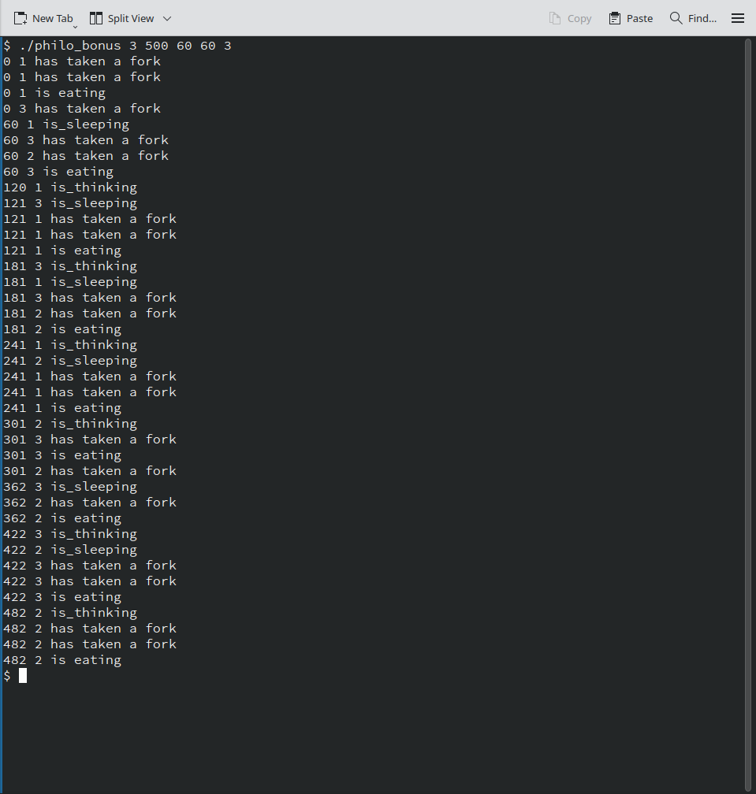

# 🧠 Philosophers
### A concurrency and synchronization project in C using threads and processes

---

## 📝 Overview

A classic concurrency problem brought to life using threads and mutexes aswell as processes and semaphores.  
The **Dining Philosophers** simulation challenge introduced me to manage shared resources, avoid race conditions and deadlocks. The Philosophers sit together and share Forks, where there are as many forks as philosophers, and philosophers can only eat with two forks.

I implemented two version: 
- **Multithreaded** using `pthreads` and `mutexes`  
- **Multiprocess** using `semaphores` and `process control`

---



---

## ✨ Features

- 🧵 **Concurrent Philosophers**  
  Each philosopher is a sepereate Thread or Process.

- 🍽 **Protected Resource managment**  
  Protected Resources managed by Mutexes and Semaphores to prevent race conditions and ensure forks are shared correctly.

- ⏱ **Precise Timing**  
  Millisecond-level timestamp logging.

- ⚰️ **Death Detection**  
  Accurate and timely reporting when a philosopher starves via a seperate mointoring Thread/Process.

- 📦 **Optional Argument Support**  
  Simulation stops early if all philosophers eat a defined number of times.

---

## 🚀 How to Run

### 🧵 Threads Version

```bash
cd philo
make
./philo number_of_philosophers time_to_die time_to_eat time_to_sleep [number_of_times_each_philosopher_must_eat]
```

### 🔁 Processes Version

```bash
cd philo_bonus
make
./philo_bonus number_of_philosophers time_to_die time_to_eat time_to_sleep [number_of_times_each_philosopher_must_eat]
```

---

## ⚙ Arguments

| Argument                          | Description                                                      |
|-----------------------------------|------------------------------------------------------------------|
| `number_of_philosophers`          | Total number of philosophers (and forks)                         |
| `time_to_die`                     | Time (ms) a philosopher survives without eating                  |
| `time_to_eat`                     | Time (ms) a philosopher spends eating                            |
| `time_to_sleep`                   | Time (ms) a philosopher sleeps after eating                      |
| `number_of_times_each_must_eat`  | *(Optional)* Stops after specified amount of eats |

---

## 🪵 Log Format

```text
timestamp_in_ms X has taken a fork
timestamp_in_ms X is eating
timestamp_in_ms X is sleeping
timestamp_in_ms X is thinking
timestamp_in_ms X died
```

*X = philosopher number*  
- Logs are thread-safe  
- "Death" log appears within 10ms of the actual event

---

## 📁 Project Structure

```plaintext
philosophers/
├── philo/                 → threads + mutexes
│   ├── src                → source files
│   ├── inc                → include files
│   └── Makefile
├── philo_bonus/           → processes + semaphores
│   ├── src                → source files
│   ├── inc                → include files
│   └── Makefile
├── docs/                  
└── README.md
```

---

## 👨‍💻 Authors

- [@bartsch-tech](https://github.com/bartsch-tech)
